# emergence — Agent CLI 工具设计文档

**日期:** 2026-05-04
**版本:** v1
**语言:** Rust (Tokio + ratatui)

---

## 1. 概述

emergence 是一款类 Claude Code / Codex 的 agent CLI 工具。v1 目标：提供完整的多轮对话 agent 体验，支持多 LLM provider、分级权限控制、会话持久化、TUI 交互界面。

### v1 范围

| 包含 | 暂不包含 |
|------|---------|
| 核心 agent loop | MCP 集成 |
| 8 个基础工具 | Hooks 系统 |
| 多 provider (OpenAI-compatible) | Anthropic native API |
| 分级权限系统 | 插件/扩展系统 |
| ratatui TUI | Web 界面 |
| 会话持久化 + 别名 | 多会话并行 |
| 斜杠命令系统 | 用户自定义命令 |
| AGENTS.md 项目配置 | 记忆系统 |

---

## 2. 整体架构

采用方案 1：单体架构。所有模块在同一 tokio 进程中，通过 trait 接口隔离，TUI 与核心循环通过 mpsc channel 通信。

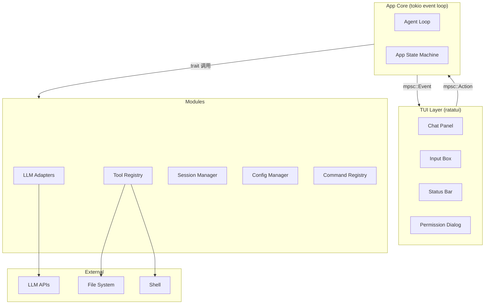

**通信模型:**

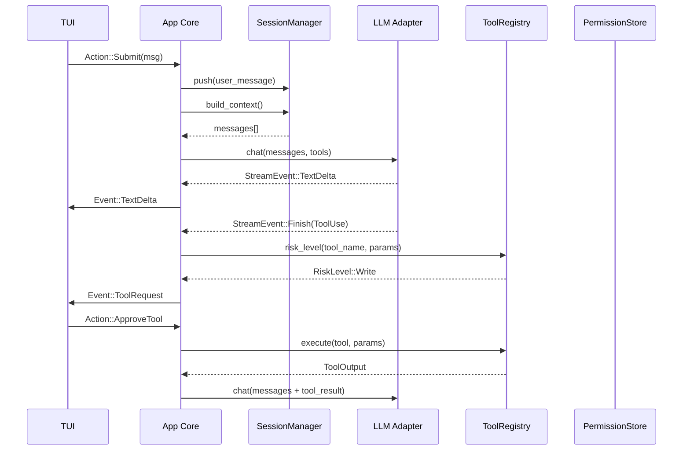

---

## 3. LLM Provider 层

内部统一使用 OpenAI-compatible 格式。所有 provider adapter 实现统一的 `Provider` trait。

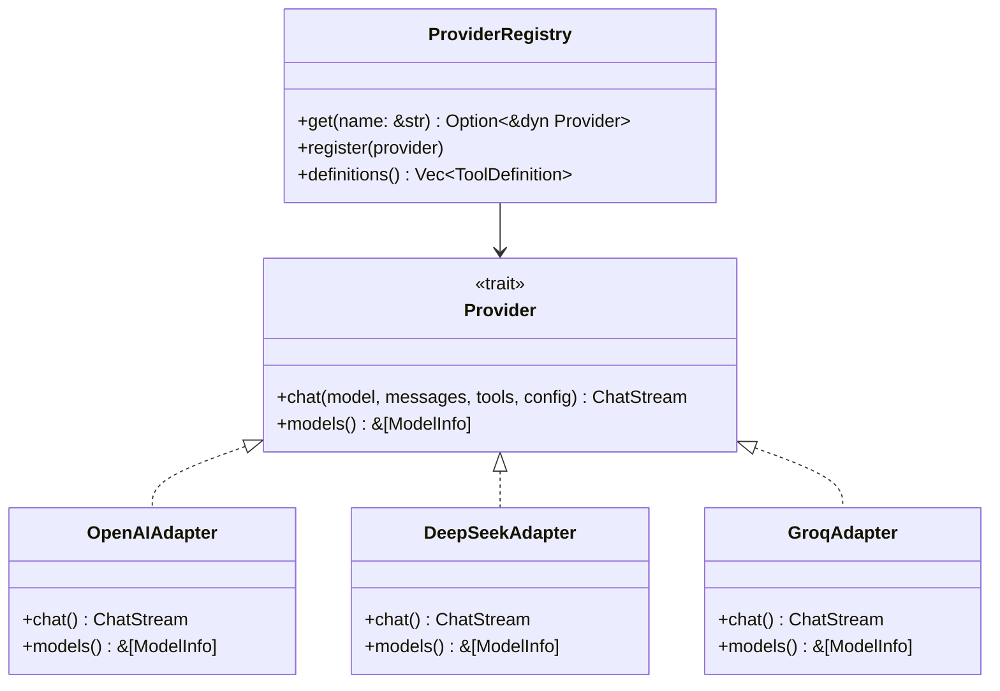

**核心接口：**

```rust
#[async_trait]
trait Provider: Send + Sync {
    async fn chat(
        &self,
        model: &str,
        messages: &[ChatMessage],
        tools: &[ToolDefinition],
        config: &GenerationConfig,
    ) -> Result<ChatStream>;

    fn models(&self) -> &[ModelInfo];
}

type ChatStream = Pin<Box<dyn Stream<Item = Result<StreamEvent>> + Send>>;

enum StreamEvent {
    TextDelta(String),
    ThinkingDelta(String),
    ToolCallDelta { id: String, name: String, arguments_json_fragment: String },
    Finish { stop_reason: StopReason, usage: Usage },
}
```

**统一消息格式 (OpenAI-compatible):**

```rust
struct ChatMessage {
    role: Role,         // System | User | Assistant | Tool
    content: Content,   // 多 part: text + tool_call + tool_result
    name: Option<String>,
}

struct ToolDefinition {
    name: String,
    description: String,
    parameters: serde_json::Value,  // JSON Schema
}

enum StopReason { EndTurn, MaxTokens, ToolUse, StopSequence }

struct GenerationConfig {
    max_tokens: u32,
    temperature: f64,
    top_p: f64,
    stop_sequences: Vec<String>,
    thinking: Option<u32>,
    tools: Option<Vec<ToolDefinition>>,
}
```

**Provider 配置 (settings.json):**

```json
{
  "providers": {
    "deepseek": {
      "api_key": "${DEEPSEEK_API_KEY}",
      "base_url": "https://api.deepseek.com/v1",
      "default_model": "deepseek-v4-pro",
      "extra_headers": {}
    }
  }
}
```

---

## 4. Tool 系统

所有工具实现统一的 `Tool` trait。Trait 方法包含风险评估，由 `ToolRegistry` 统一管理。

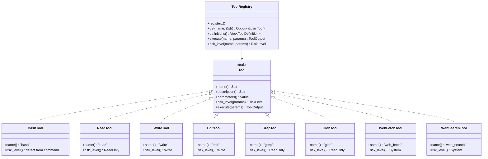

**风险等级定义：**

```rust
#[derive(PartialOrd, Ord)]
enum RiskLevel {
    ReadOnly,  // 无需确认（read, grep, glob）
    Write,     // y/n 确认（write, edit, bash safe）
    System,    // 需显式授权（bash dangerous, web_fetch, web_search）
}
```

**v1 Tool Set (8 个工具):**

| 工具 | 风险等级 | 说明 |
|------|----------|------|
| `bash` | Write/System | 根据命令内容分级。无副作用 ReadOnly，写文件 Write，sudo/rm/curl|sh 等 System |
| `read` | ReadOnly | 读取文件，支持 offset/limit |
| `write` | Write | 创建或覆盖文件 |
| `edit` | Write | 精确字符串替换 |
| `grep` | ReadOnly | 文本内容搜索 |
| `glob` | ReadOnly | 文件模式匹配 |
| `web_fetch` | System | HTTP GET，提取为 markdown |
| `web_search` | System | 调用搜索 API |

**Bash 风险分级逻辑:** 通过关键词模式匹配识别危险命令（rm, sudo, chmod, curl|sh, mkfs, dd, >/dev/sda 等），返回对应的 RiskLevel。

---

## 5. 权限系统

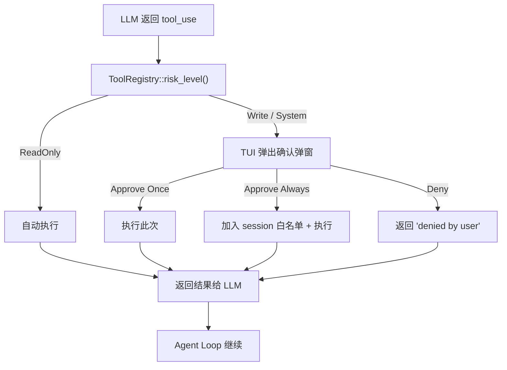

**Session 白名单：**

```rust
struct PermissionStore {
    always_allow: HashSet<(String, RiskLevel)>,
}
```

白名单仅当前 session 有效，关闭后重置。不在会话持久化文件中保存。

**权限弹窗 TUI 设计：**

```
┌ ── Permission Required ──────────────────┐
│                                            │
│  Tool: bash                                │
│  Risk: ⚠ Write                            │
│                                            │
│  Command:                                  │
│    cargo build --release                   │
│                                            │
│  [A]pprove Once  [Y]es Always  [D]eny     │
└────────────────────────────────────────────┘
```

---

## 6. 对话与上下文管理

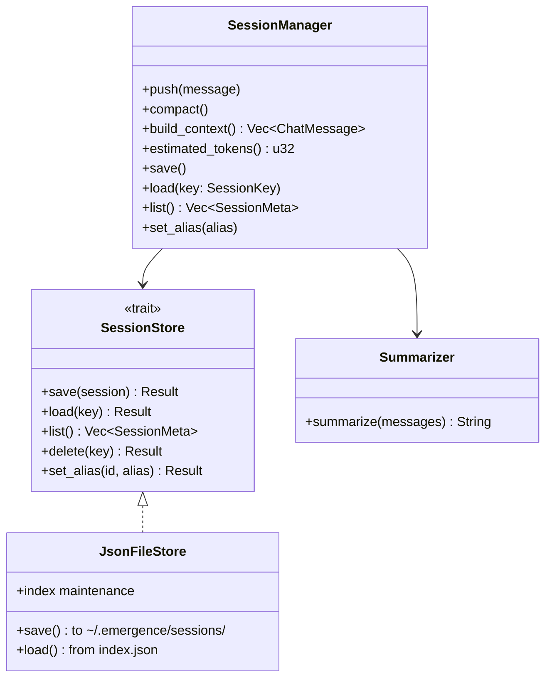

**Compaction 策略:**

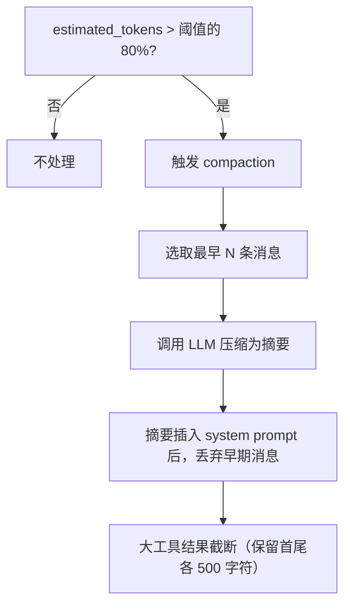

**Compaction 阈值:** 从 settings.json 读取（默认 80,000 tokens），也可通过 `/compact` 命令手动触发。

**会话持久化:**

```
~/.emergence/sessions/
├── index.json                    # id ↔ alias 映射 + meta 列表
├── 2026-05-04-143022.json       # 完整对话历史
└── 2026-05-04-150000.json

index.json:
{
  "sessions": [
    {
      "id": "2026-05-04-143022",
      "alias": "feature-x",
      "updated_at": "2026-05-04T14:35:00Z"
    }
  ]
}
```

**别名查询:** `/sessions` 同时支持 id 和别名查找。`SessionKey::Id` 和 `SessionKey::Alias` 两种查询方式，别名通过 index.json 解析到 id。

**ContextBuilder:** 构建发送给 LLM 的消息序列：

```
[SystemMessage(system_prompt + AGENTS.md + tools)]
  → [SummaryMessage(compaction 摘要)]  (如有)
  → [当前窗口的 messages...]
```

---

## 7. TUI 设计

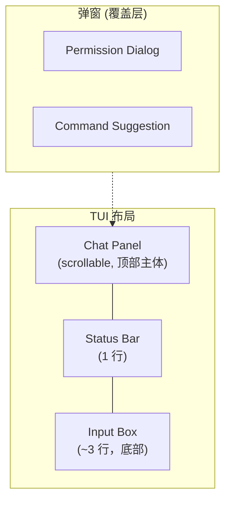

**布局划分：**

```
┌──────────────────────────────────────────────────┐
│                                                  │
│  [14:30:02] You: 帮我添加一个 greet 函数          │  ← Chat Panel
│                                                  │
│  [14:30:05] 🤖 (2.3s · 456 tokens):              │
│    好的，我来添加 greet 函数...                      │
│                                                  │
│  [14:30:08] 🔧 tool:read (120ms):                │
│  ┌──────────────────────────────┐                │
│  │ src/main.rs:1-20             │                │
│  └──────────────────────────────┘                │
│                                                  │
├──────────────────────────────────────────────────┤
│  emergence · deepseek-v4-pro · 12K/200K · ✓     │ ← Status Bar
├──────────────────────────────────────────────────┤
│  > _                                              │ ← Input Box
│  [Ctrl+S 发送] [Esc 取消] [↑↓ 历史]               │
└──────────────────────────────────────────────────┘
```

**消息渲染格式：**

- 每条消息前缀 `[HH:MM:SS]` 时间戳
- 助手消息额外显示 `(耗时 · token 数)`
- Tool 调用额外显示 `(耗时)` — 从 tool request 到 tool result 的时间
- 流式输出中耗时数字实时跳动，token 数递增

**Status Bar 格式：**

```
 emergence · deepseek-v4-pro · 12,340/200,000 tokens · ⏳ streaming
 emergence · deepseek-v4-pro · 12,340/200,000 tokens · ✓ ready
```

**输入特性：**

- 多行编辑，类似 vim insert 模式
- Ctrl+S 提交，Esc 清空
- ↑↓ 方向键浏览历史（最多 1000 条）
- 历史保存在 `~/.emergence/history/<session-id>.json`

---

## 8. 斜杠命令系统

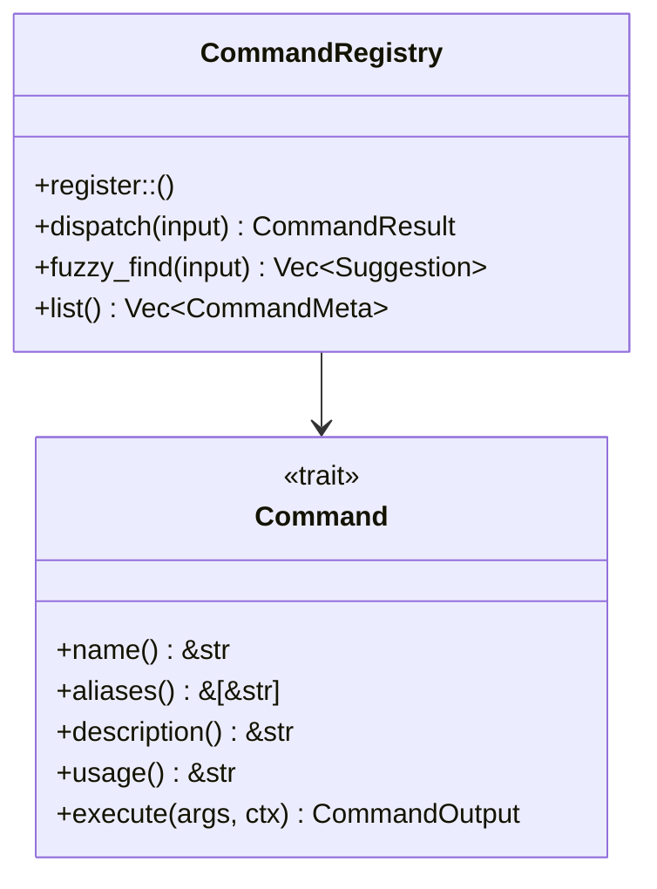

**v1 内置命令：**

| 命令 | 别名 | 功能 |
|------|------|------|
| `/help` | `/?` | 列出所有命令或查看某命令详情 |
| `/clear` | - | 清空当前对话上下文，保留 system prompt |
| `/compact` | - | 手动触发上下文压缩，支持 `/compact status` |
| `/config` | - | 查看/修改配置：`/config model <name>`，`/config reload` |
| `/sessions` | `/s` | 列出、切换、删除、别名管理 |
| `/quit` | `/q`, `/exit` | 退出程序 |
| `/model` | `/m` | 快速切换模型 |
| `/tokens` | `/t` | 显示当前 token 用量详情 |
| `/tools` | - | 列出可用工具及风险等级 |

**模糊匹配：** 输入以 `/` 开头但未精确匹配时，使用 Levenshtein 编辑距离（阈值 ≤ 3）查找最近命令并提示：

```
⚠ Unknown command '/compac'. Did you mean:
  → /compact    (压缩上下文)
  → /config     (查看/修改配置)
```

**解析规则：** 以 `/` 开头 → 命令系统；否则 → Agent Loop 对话消息。参数以 shell 风格解析。

---

## 9. 数据流

一次典型请求的完整路径：

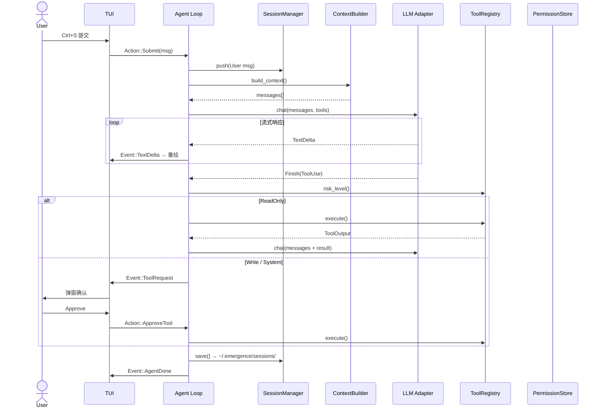

---

## 10. 配置系统

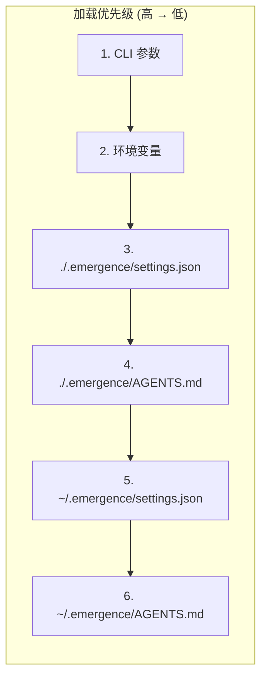

**settings.json 结构：**

```json
{
  "version": 1,
  "model": "deepseek/deepseek-v4-pro",
  "generation": {
    "max_tokens": 32000,
    "temperature": 0.7,
    "thinking": 32000
  },
  "providers": {
    "deepseek": {
      "api_key": "${DEEPSEEK_API_KEY}",
      "base_url": "https://api.deepseek.com/v1",
      "default_model": "deepseek-v4-pro"
    }
  },
  "permissions": {
    "auto_approve": ["read", "grep", "glob"],
    "deny_patterns": ["sudo rm -rf /", "mkfs.*"]
  },
  "tools": {
    "disabled": []
  },
  "session": {
    "store_dir": "~/.emergence/sessions",
    "auto_save": true,
    "compaction_threshold_tokens": 80000
  }
}
```

**AGENTS.md:** 项目级指令文件，内容作为 system prompt 的 "Project Instructions" 段注入。

**ConfigManager 职责：** 多级配置合并、`${ENV_VAR}` 占位符解析、`/config reload` 重载、必需字段校验。

---

## 11. 错误处理

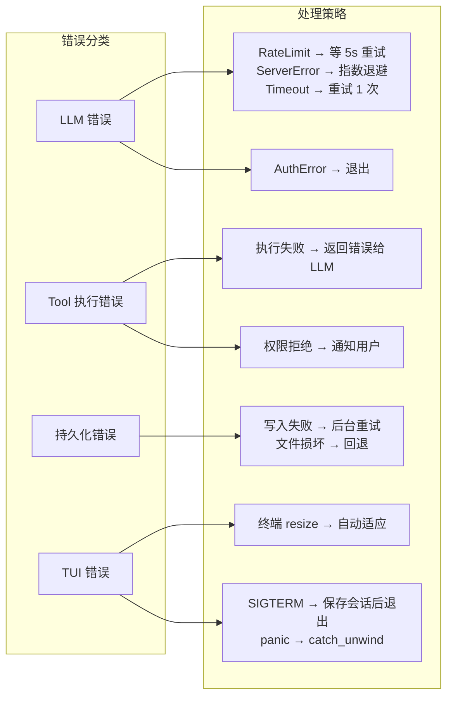

所有非致命错误通过 `Event::Error { message }` 通知 TUI 层，显示在 Chat Panel 中，不中断 agent loop。

---

## 12. 测试策略

| 层级 | 工具 | 内容 |
|------|------|------|
| 单元测试 | `cargo test` | Provider adapter 消息转换、工具参数解析、bash 风险分类、编辑距离模糊匹配、配置合并逻辑 |
| 集成测试 | `cargo test` | Agent Loop 模拟（mock LLM + mock tools）、Session 持久化往返、ConfigManager 加载 |
| E2E 测试 | 集成脚本 | 完整对话流程（录制 LLM 响应）、权限弹窗交互（模拟键盘输入） |

TUI 测试在 v1 以手动验证为主，自动化排版快照测试投入产出比有限。

---

## 13. 项目文件结构

```
emergence/
├── Cargo.toml
├── src/
│   ├── main.rs              # 入口：初始化 → TUI → event loop
│   ├── app.rs               # App state, AgentLoop 实现
│   ├── tui/
│   │   ├── mod.rs           # Terminal 初始化、主渲染循环
│   │   ├── widgets.rs       # ChatPanel, InputBox, StatusBar 组件
│   │   ├── popups.rs        # 权限弹窗
│   │   └── themes.rs        # 颜色、样式
│   ├── llm/
│   │   ├── mod.rs           # Provider trait, StreamEvent
│   │   ├── registry.rs      # ProviderRegistry
│   │   ├── openai.rs        # OpenAI-compatible adapter
│   │   └── message.rs       # ChatMessage, ToolDefinition, 格式转换
│   ├── tools/
│   │   ├── mod.rs           # Tool trait, ToolRegistry
│   │   ├── bash.rs
│   │   ├── file.rs          # read, write, edit
│   │   ├── search.rs        # grep, glob
│   │   └── web.rs           # web_fetch, web_search
│   ├── permissions/
│   │   ├── mod.rs           # RiskLevel, PermissionStore
│   │   └── bash_classifier.rs
│   ├── session/
│   │   ├── mod.rs           # Session, SessionManager
│   │   ├── store.rs         # SessionStore trait, JsonFileStore
│   │   ├── context.rs       # ContextBuilder, compaction
│   │   └── summarizer.rs    # LLM 调用生成摘要
│   ├── config/
│   │   ├── mod.rs           # ConfigManager
│   │   ├── settings.rs      # Settings 结构体、解析
│   │   └── agents_md.rs     # AGENTS.md 解析
│   ├── commands/
│   │   ├── mod.rs           # Command trait, CommandRegistry
│   │   ├── help.rs
│   │   ├── clear.rs
│   │   ├── compact.rs
│   │   ├── config.rs
│   │   ├── sessions.rs
│   │   ├── model.rs
│   │   ├── tokens.rs
│   │   ├── tools.rs
│   │   └── quit.rs
│   └── utils/
│       ├── fuzzy.rs         # 编辑距离匹配
│       └── env.rs           # 环境变量展开
└── tests/
    ├── integration/
    │   ├── agent_loop.rs
    │   ├── session_persistence.rs
    │   └── config_loading.rs
    └── fixtures/
        ├── mock_llm_responses.json
        └── sample_settings.json
```

---

## 14. 依赖

**核心依赖 (Cargo.toml):**

| crate | 用途 |
|-------|------|
| `tokio` (full) | 异步运行时 |
| `ratatui` | TUI 框架 |
| `crossterm` | 终端控制 |
| `reqwest` | HTTP (LLM API, web tools) |
| `serde` / `serde_json` | 序列化、settings.json 解析 |
| `async-trait` | async trait 支持 |
| `tokio-stream` | Stream 抽象 |
| `clap` | CLI 参数解析 |
| `tracing` + `tracing-subscriber` | 日志 |

**dev 依赖：**

| crate | 用途 |
|-------|------|
| `mockall` | Mock trait 生成 |
| `tempfile` | 临时目录（测试用） |
| `tokio-test` | 异步测试工具 |
